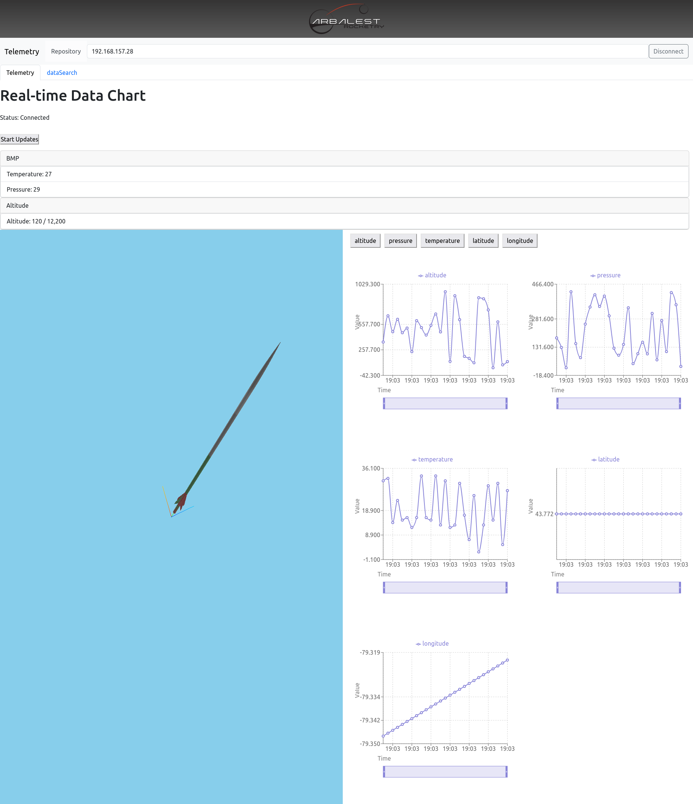

# Ground Station GUI by `Chan Woo Hwang`
<div style="display: flex; flex-direction: row;">
    



## Root of the folder
```
├── client
    ├──src
    ├──public
├── server
    ├──app.py
    ├──venv
├── transceiver
└── README.md
```

```client``` 
This directory contains the React application which serves as the frontend of the Ground Station GUI. It includes all the React components, styles, and other assets needed to build and run the client-side application.

```server```
This directory contains the Flask server which handles the backend operations. The server is responsible for managing WebSocket connections, processing telemetry data, and serving API endpoints.

```transceiver```
This directory contains the Arduino sketches (.ino files) for various boards used in the telemetry system. Each subdirectory within transceiver/ corresponds to a different board and contains the code needed to operate that board.

## Project Setup Guide
## Introduction
This guide provides the steps to set up and run the client and server components of the project. The setup involves navigating to the respective directories, starting the client, and activating the server environment.

### Prerequisites
Node.js and npm installed
Python and pip installed
Virtual environment setup for the server
## Setup Steps
### Terminal 1 (T1): Client Setup
Navigate to the client directory:

```
cd root/client
Start the client:
```

```
npm start
```
### Terminal 2 (T2): Server Setup

#### Activate the virtual environment:
For Windows:
```
venv\Scripts\activate
```
For Linux/Mac:
```
source venv/Scripts/activate
```

#### Install the dependencies:

For Windows:
```
setup.bat
```
For Linux/Mac:
```
source setup.sh
```
#### Navigate to the server directory
```
cd ../server
```
#### Run the server:

```
python app.py
```
## Additional Information
Ensure both the client and server are running simultaneously in separate terminals. <br>
The client will be accessible at the specified URL once started.<br>
The server will be running on the configured port as defined in app.py.<br>
Feel free to modify any section to better suit your project's specific needs or to add any additional information that may be required.<br>
